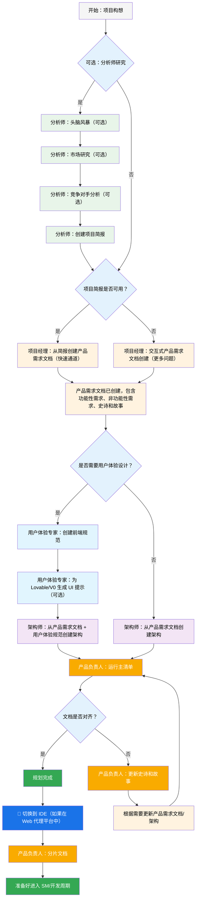
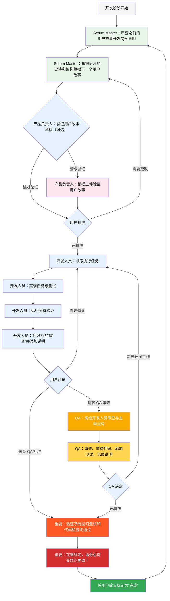

# BMad-Method BMAd 代码用户指南

本指南将帮助您理解并有效使用 BMad 方法进行敏捷的 AI 驱动规划和开发。

## BMad 规划与执行工作流

首先，这里是完整的标准全新项目（Greenfield）规划与执行工作流。现有项目（Brownfield）的工作流非常相似，但建议您先通过一个简单的项目来理解全新项目的工作流，然后再处理现有项目。BMad 方法需要安装到您新项目文件夹的根目录。在规划阶段，您可以选择使用强大的 Web 代理来执行，这可能会以更低的成本获得更高质量的结果，特别是当您在某些代理工具中提供自己的 API 密钥或积分时。对于规划，强大的思维模型和更广的上下文——并与代理作为合作伙伴协同工作——将会产生最佳结果。

如果您打算在现有项目（一个已经存在的项目）中使用 BMad 方法，请查阅 **[在现有项目中工作](./working-in-the-brownfield.zh-CN.md)**。

如果您无法看到下方呈现的图表，可以为 VSCode 安装“Markdown All in One”以及“Markdown Preview Mermaid Support”插件（或其某个复刻克隆版本）。安装这些插件后，当文件打开时，右键单击其选项卡应出现“打开预览”选项，或请查阅您 IDE 的相关文档。

### 规划工作流（Web UI 或强大的 IDE 代理）

在开发开始之前，BMad 遵循一个结构化的规划工作流，为实现成本效益，该流程最好在 Web UI 中完成：



#### Web UI 到 IDE 的转换

**关键转换点**：一旦产品负责人确认文档对齐，您必须从 Web UI 切换到 IDE 以开始开发工作流：

1.  **将文档复制到项目**：确保 `docs/prd.md` 和 `docs/architecture.md` 位于您项目的 `docs` 文件夹中（或您在安装时指定的自定义位置）。
2.  **切换到 IDE**：在您首选的代理 IDE 中打开您的项目。
3.  **文档分片**：使用产品负责人（PO）代理先对产品需求文档（PRD）进行分片，然后对架构文档进行分片。
4.  **开始开发**：启动接下来的核心开发周期。

### 核心开发周期 (IDE)

规划完成且文档分片后，BMad 将遵循一个结构化的开发工作流：



## 安装

### 可选

如果您想在 Web 上使用 Claude (Sonnet 4 或 Opus)、Gemini Gem (2.5 Pro) 或自定义 GPT 进行规划：

1.  导航至 `dist/teams/`
2.  复制 `team-fullstack.txt`
3.  创建新的 Gemini Gem 或 CustomGPT
4.  上传文件并附上说明：“您关键的操作说明已附上，请严格遵守角色设定”
5.  输入 `/help` 查看可用命令

### IDE 项目设置

```bash
# 交互式安装（推荐）
npx bmad-method install
```

## 特殊代理

目前有两个 BMad 代理——未来它们将被整合为单一的 `bmad-master`。

### BMad-Master

该代理能够执行除实际故事实现外的所有其他代理的任务和命令。此外，在 Web 环境中，该代理可以通过访问知识库来解释 BMad 方法的任何方面。

如果您不想在开发代理之外频繁切换其他代理，那么这个代理是您的不二之选。但请记住，随着上下文的增长，代理的性能会下降。因此，定期指示代理压缩对话，并以压缩后的内容作为初始消息开始新的对话，这一点非常重要。建议在每个故事实现后都执行此操作。

### BMad-Orchestrator

此代理不应在 IDE 内部使用。它是一个重量级的、特殊用途的代理，会利用大量上下文，并能转变为任何其他代理。它的存在完全是为了在 Web 包中协调团队工作。如果您使用 Web 包，您将会由 BMad Orchestrator 迎接。

### 代理如何工作

#### 依赖系统

每个代理都有一个 YAML 部分，用于定义其依赖项：

```yaml
dependencies:
  templates:
    - prd-template.md
    - user-story-template.md
  tasks:
    - create-doc.md
    - shard-doc.md
  data:
    - bmad-kb.md
```

**关键点：**

-   代理只加载它们需要的资源（精简上下文）。
-   依赖项在捆绑过程中自动解析。
-   资源在代理之间共享以保持一致性。

#### 代理交互

**在 IDE 中：**

```bash
# 某些 IDE（如 Cursor 或 Windsurf）使用手动规则，因此交互通过“@”符号完成
@pm 为任务管理应用创建一个 PRD
@architect 设计系统架构
@dev 实现用户身份验证

# 某些 IDE（如 Claude Code）则使用斜杠命令
/pm 创建用户故事
/dev 修复登录错误
```

#### 交互模式

-   **增量模式**：在用户输入下逐步执行。
-   **YOLO 模式**：以最少的交互快速生成。

## IDE 集成

### IDE 最佳实践

-   **上下文管理**：仅将相关文件保留在上下文中，保持文件精简和专注。
-   **代理选择**：为不同任务选择合适的代理。
-   **迭代开发**：以小的、专注的任务进行工作。
-   **文件组织**：保持清晰的项目结构。
-   **定期提交**：频繁保存您的工作。

## 技术偏好系统

BMad 通过位于 `.bmad-core/data/` 目录下的 `technical-preferences.md` 文件提供个性化系统。该文件可以影响项目经理（PM）和架构师，使其在设计模式、技术选型等方面推荐您的偏好。

### 与 Web 包结合使用

在创建自定义 Web 包或上传到 AI 平台时，请包含您的 `technical-preferences.md` 内容，以确保代理从对话一开始就了解您的偏好。

## 核心配置

`bmad-core/core-config.yaml` 文件是一个关键配置文件，它使 BMad 能够无缝适应不同的项目结构。未来将提供更多选项。目前，最重要的是 YAML 文件中的 `devLoadAlwaysFiles` 列表部分。

### 开发者上下文文件

定义开发代理应始终加载的文件：

```yaml
devLoadAlwaysFiles:
  - docs/architecture/coding-standards.md
  - docs/architecture/tech-stack.md
  - docs/architecture/project-structure.md
```

您需要通过分片架构来验证这些文件是否存在，确保它们尽可能精简，并准确包含您希望开发代理始终加载到其上下文中的信息。这些是代理将遵循的规则。

随着项目的发展和代码模式的固化，编码标准应逐步精简，仅保留那些代理仍会出错的标准。代理会分析文件中的邻近代码，以推断与当前任务相关的编码标准。

## 获取帮助

-   **Discord 社区**：[加入 Discord](https://discord.gg/gk8jAdXWmj)
-   **GitHub Issues**：[报告错误](https://github.com/bmadcode/bmad-method/issues)
-   **文档**：[浏览文档](https://github.com/bmadcode/bmad-method/tree/main/docs)
-   **YouTube**：[BMadCode 频道](https://www.youtube.com/@BMadCode)

## 结论

请记住：BMad 旨在增强您的开发流程，而非取代您的专业知识。请将其作为一个强大的工具，在加速项目的同时，确保您对设计决策和实现细节的掌控。